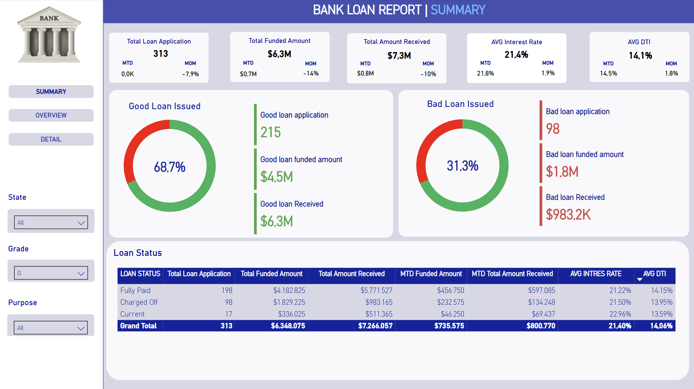
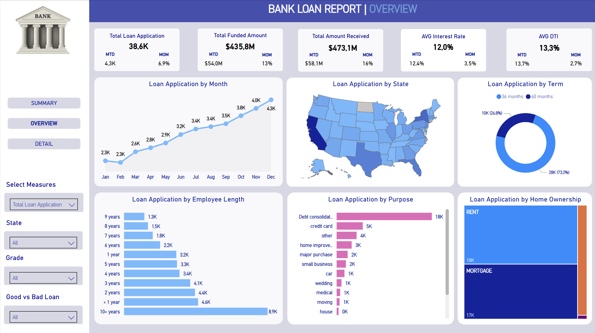
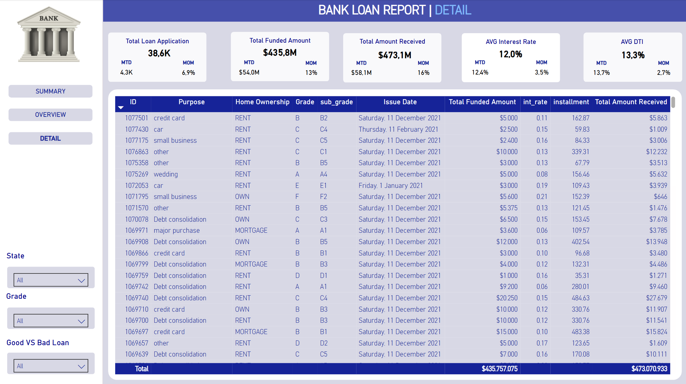

# Bank Loan Dashboard

This Power BI dashboard provides a view of loan applications handled by the bank. It is designed to help stakeholders easily monitor key metrics, explore data trends, and gain insights into the overall loan performance. The dashboard consists of multiple interactive pages that allow users to drill down into the data and analyze it from different perspectives.

Tools Used
- Power BI Desktop
- DAX (Data Analysis Expressions)
- Power Query (Data Transformation)

## Screenshots
- **Summary Page**

- **Overview Page**

- **Details Page**

